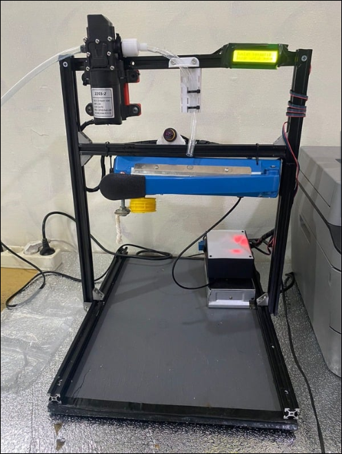

# Milk-Packager
This repository is a complete system for packaging liquids (sepecifially goat milk) and the monitoring of said packaging process. The packaging uses 3D printer frames, heat sealer, heavy duty servo to initiate the sealing, a pump to force the liquid into the packaging, and ESP32 as the MCU.

# Hardware

# System Block Diagram

# Software Flowchart

